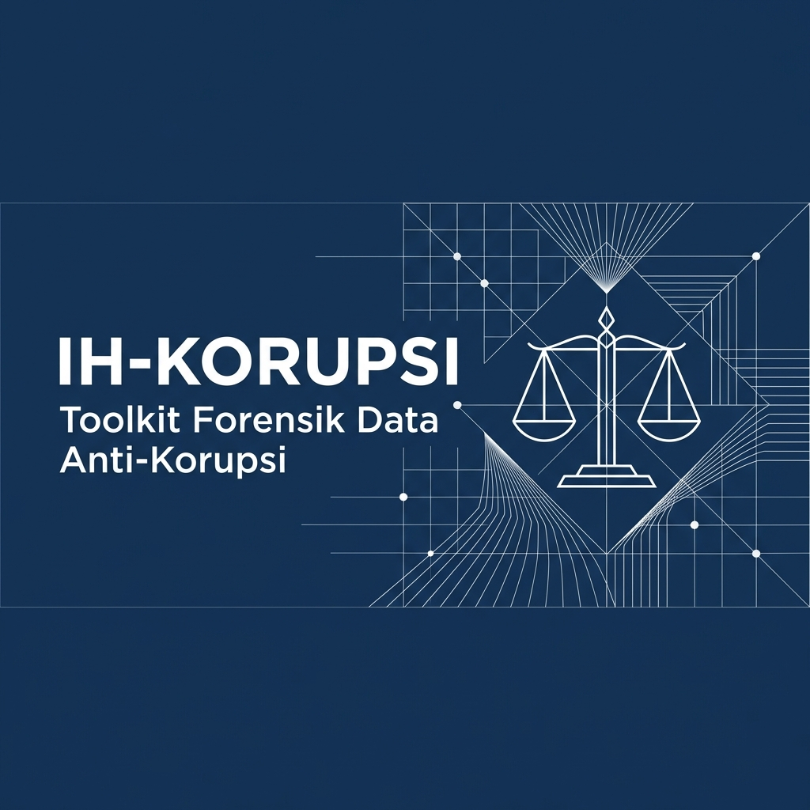

# IH-Korupsi: Toolkit Forensik Data Anti-Korupsi

**IH-Korupsi** adalah singkatan dari **Indikasi Hukum Korupsi** - sebuah toolkit Open Source berbasis Python untuk mendeteksi anomali keuangan dan potensi korupsi menggunakan metode matematika murni **tanpa AI/Machine Learning**.

Dibuat oleh **OurCreativity Edisi Coding** untuk mendukung transparansi dan akuntabilitas keuangan publik.

---

## Mengapa IH-Korupsi?

Korupsi merugikan bangsa dan ekonomi. IH-Korupsi hadir sebagai alat edukatif yang bisa digunakan oleh:
- Auditor internal pemerintah
- Jurnalis investigasi
- Peneliti anti-korupsi
- Mahasiswa yang mempelajari forensik data
- LSM transparansi
- Siapa saja yang peduli dengan pemberantasan korupsi

### Prinsip Dasar
1. **Transparan**: Setiap deteksi anomali bisa dijelaskan dengan rumus matematika
2. **Auditable**: Tidak ada "black box" - semua algoritma terbuka
3. **Tanpa AI**: Murni statistik dan matematika agar hasil bisa dipertanggungjawabkan
4. **Open Source**: Bebas digunakan, dipelajari, dan dikembangkan

---

## Fitur Utama

### 1. The Mathematician (Deteksi Statistik)

#### Hukum Benford
Mendeteksi manipulasi angka pada laporan keuangan. Hukum Benford menyatakan bahwa dalam data keuangan alami, digit pertama angka mengikuti distribusi logaritmik. Jika seseorang membuat angka palsu, distribusinya akan menyimpang.

**Contoh Kasus**: Laporan keuangan yang dimanipulasi cenderung memiliki terlalu banyak angka yang dimulai dengan digit 5, 6, 7, 8.

#### Relative Size Factor (RSF)
Mendeteksi transaksi yang tidak wajar untuk suatu vendor. RSF membandingkan transaksi terbesar vendor dengan rata-rata transaksi mereka yang lain.

**Rumus**: `RSF = Transaksi Terbesar / Rata-rata Transaksi Lainnya`

**Contoh Kasus**: Vendor yang biasanya menerima Rp 5-10 juta tiba-tiba mendapat kontrak Rp 500 juta.

#### Z-Score dan IQR
Metode statistik standar untuk menemukan outlier (pencilan) ekstrem dalam data transaksi.

---

### 2. The Connector (Analisis Jaringan)

#### Deteksi Perdagangan Memutar (Circular Trading)
Menemukan aliran dana yang kembali ke pengirim asli melalui beberapa perantara.

**Contoh Kasus**: 
```
Dinas A → PT. X → CV. Y → PT. Z → Dinas A
```
Pola ini sering digunakan untuk mark-up harga atau pencucian uang.

#### Analisis Sentralitas
Menemukan aktor kunci yang tersembunyi dalam jaringan korupsi menggunakan algoritma PageRank dan Betweenness Centrality.

---

### 3. The Chronologist (Analisis Waktu)

#### Fiscal Cliff Dumping
Mendeteksi lonjakan pengeluaran tidak wajar di akhir tahun anggaran. Pejabat yang takut anggaran dipotong sering "membakar" uang di bulan Desember.

**Indikator**: Rasio pengeluaran Desember vs rata-rata bulanan > 2.5x

#### Velocity Check
Mendeteksi frekuensi transaksi yang tidak manusiawi dalam waktu singkat.

**Contoh Kasus**: 50 transaksi dalam 1 hari untuk vendor yang sama.

---

### 4. String Detective (Deteksi Nama Ganda)

#### Fuzzy Matching
Menemukan "vendor hantu" - entity dengan nama yang sedikit berbeda tapi sebenarnya sama.

**Contoh**:
- `PT. Maju Jaya` vs `PT. Maju  Jaya` (spasi ganda)
- `CV. Berkah Mandiri` vs `CV. Barkah Mandiri` (typo)

Menggunakan algoritma Levenshtein Distance tanpa library AI.

---

## Instalasi

### Persyaratan Sistem
- Python 3.10 atau lebih baru
- Windows / Linux / MacOS

### Langkah Instalasi

1. Clone repository ini:
```bash
git clone https://github.com/[username]/ih-korupsi.git
cd ih-korupsi
```

2. Install dependencies:
```bash
pip install -r requirements.txt
```

3. Selesai! Toolkit siap digunakan.

---

## Cara Penggunaan

### Mode 1: Analisis Data Sample (Untuk Belajar)

Jalankan dengan data sintetis yang sudah disediakan dan buat laporan visual:

```bash
python main.py --type sample --output laporan_sample.json --html laporan_visual.html
```

Sistem akan:
1. Membuat 500 baris data transaksi palsu
2. Menanamkan anomali yang disengaja (Benford, RSF, Fiscal Cliff)
3. Menjalankan analisis deteksi
4. Menghasilkan laporan JSON (untuk data) dan HTML (untuk visualisasi cantik)

### Mode 2: Analisis Data Anda Sendiri

#### Format CSV
File CSV harus memiliki kolom minimal:
- `amount` = Nilai transaksi
- `vendor_name` = Nama vendor/penerima
- `vendor_id` = ID unik vendor
- `date` = Tanggal transaksi
- `sender_id` = Pengirim
- `receiver_id` = Penerima

Contoh:
```bash
python main.py --input data_keuangan.csv --type csv --output laporan_hasil.json
```

#### Format JSON
```bash
python main.py --input data.json --type json --output hasil.json
```

---

## Memahami Laporan Hasil

Laporan disimpan dalam format JSON dengan struktur:

```json
{
  "metadata": {
    "total_rows": 500,
    "total_amount": 300000000,
    "currency": "IDR"
  },
  "findings": {
    "The Mathematician": { ... },
    "The Connector": { ... },
    "The Chronologist": { ... },
    "String Detective": { ... }
  }
}
```

### Interpretasi Temuan

#### Benford's Law
- **MAD < 0.006**: Sangat sesuai (Normal)
- **MAD 0.006-0.012**: Dapat diterima
- **MAD 0.012-0.015**: Marginal (Perlu perhatian)
- **MAD > 0.015**: Tidak sesuai (Red flag!)

#### RSF
- **RSF < 5**: Normal
- **RSF 5-10**: Perlu dicek
- **RSF > 10**: Sangat mencurigakan

#### Fiscal Cliff
- **Rasio < 1.5**: Normal
- **Rasio 1.5-2.5**: Peningkatan signifikan
- **Rasio > 2.5**: Budget dumping ekstrem

---

## Contoh Kasus Nyata (Edukatif)

### Kasus 1: Manipulasi Digit Pertama
Seorang bendahara membuat laporan pengeluaran fiktif. Karena malas, dia membuat angka-angka acak yang banyak dimulai dengan 5, 6, 7. IH-Korupsi langsung mendeteksi melalui Benford's Law dengan MAD 0.18.

### Kasus 2: Vendor Hantu
Sebuah dinas memiliki 3 vendor dengan nama mirip: "PT. Sejahtera", "PT. Sejatera", "PT. Se-Jahtera". String Detective menemukan similarity 95%+. Investigasi lebih lanjut menunjukkan pemiliknya sama.

### Kasus 3: Circular Trading
Dana APBD mengalir: Dinas → Kontraktor A → Supplier B → Konsultan C → kembali ke Dinas (melalui pejabat). The Connector menemukan cycle 4-node ini.

---

## Batasan dan Catatan Penting

1. **Bukan Bukti Hukum**: IH-Korupsi hanya memberikan **indikasi awal**. Anomali belum tentu korupsi. Diperlukan investigasi lebih lanjut.

2. **Context Matters**: Beberapa anomali bisa dijelaskan secara sah. Contoh: Proyek infrastruktur besar memang menghasilkan RSF tinggi.

3. **Data Quality**: Garbage in, garbage out. Pastikan data input bersih dan valid.

4. **Ethical Use**: Toolkit ini untuk transparansi dan edukasi, bukan untuk fitnah atau black campaign.

---

## Roadmap Pengembangan

- [ ] Export laporan ke format PDF/HTML
- [ ] Dashboard visualisasi web
- [ ] Integrasi dengan database SQL langsung
- [ ] Modul khusus untuk pengadaan barang/jasa
- [ ] Analisis tren multi-tahun
- [ ] Dokumentasi lebih lengkap dengan video tutorial

---

## Kontribusi

IH-Korupsi adalah proyek Open Source. Kami menerima kontribusi dalam bentuk:
- Laporan bug
- Fitur baru
- Perbaikan dokumentasi
- Studi kasus edukatif
- Terjemahan ke bahasa daerah

Silakan buat Pull Request atau Issue di GitHub.

---

## Lisensi

Proyek ini menggunakan lisensi **MIT License** - bebas digunakan untuk tujuan edukatif dan non-komersial.

---

## Disclaimer

Toolkit ini dibuat untuk tujuan **edukatif dan penelitian**. Penggunaan untuk tuduhan tanpa bukti yang cukup adalah tanggung jawab pengguna. Selalu lakukan due diligence dan verifikasi independen.

---

## Tentang OurCreativity Edisi Coding

Kami adalah komunitas developer yang percaya teknologi bisa digunakan untuk kebaikan sosial. IH-Korupsi adalah salah satu proyek kami untuk mendukung Indonesia bebas korupsi.

**Slogan**: "Kode untuk Keadilan, Data untuk Transparansi"

---

## Kontak dan Dukungan

Jika Anda menemukan bug atau memiliki pertanyaan:
- Buat Issue di GitHub repository ini
- Untuk kerjasama: [@oc.edisicoding](https://instagram.com/oc.edisicoding)

---

**Mari bersama membangun Indonesia yang lebih transparan dan akuntabel!**

---

*Dibuat dengan dedikasi untuk masa depan Indonesia yang lebih baik.*
